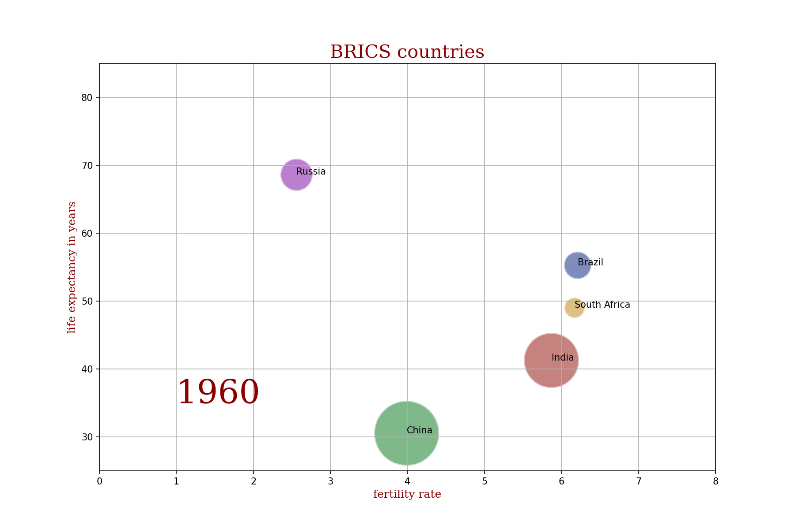

# brics-gapminder

This was my first data science project that I'd like to keep as a symbolic repo to remember how it all started. It is referring to a great project named Gapminder which you can find look up **[here](gapminder.org)**.

The animated graph shows the developement of total fertility rate of the BRICS Countries (Brasil, Russia, India, China, South Afrika) between the years 1960 and 2015. 

  

The output generates a GIF file:

## Liblaries I worked with:
---
 

 

  

  

  

 

